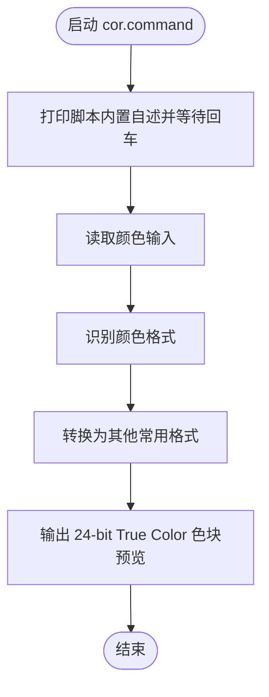

# cor.command


[toc]

## 🔥 <font id=前言>前言</font>

- 采用 Shell 脚本的原因：Shell 来自 [**macOS**](https://www.apple.com/macos/) 原生系统底层，虽然写法相对繁琐冗杂，但执行效率高，并且不需要额外介入 [**Ruby**](https://www.ruby-lang.org)、[**Python**](https://www.python.org) 等第三方运行环境，因此具备更好的移植性。


## 一、功能

转换 HEX / RGB / RGBA / `0xAARRGGBB` 等颜色格式，并在 macOS 终端输出真实色块预览。

本版重点修复：macOS 自带 Terminal.app 经常不设置 `COLORTERM=truecolor`，旧逻辑会误判终端不支持 24-bit True Color，导致色块显示不准确或看起来没有正常显示。现在对 Terminal.app、iTerm2、VS Code 终端、WezTerm 默认启用 24-bit ANSI 色彩输出。

## 二、支持输入

```zsh
./cor.command '#D2D4DE'
./cor.command D2D4DE
./cor.command '#D2D4DE80'
./cor.command D2D4DE80
./cor.command '#ABC'
./cor.command '#ABCF'
./cor.command 'rgb(210,212,222)'
./cor.command 'rgba(210,212,222,0.5)'
./cor.command '0x80D2D4DE'
./cor.command '0xD2D4DE'
```

说明：

- `#RRGGBBAA` / 裸 `RRGGBBAA` 按 `RRGGBBAA` 解析。
- `0xAARRGGBB` 按 Apple / UIKit 常见的 `AARRGGBB` 解析。
- 终端无法真实显示透明背景，Alpha 只参与格式转换；色块按 RGB 原色显示。
- 在 zsh 里直接输入 `#D2D4DE` 会被当作注释，建议加引号，或直接输入裸色值 `D2D4DE`。

## 三、运行

双击 `.command` 或终端执行：

```zsh
./cor.command
```

如果已经加入 `PATH`，也可以执行：

```zsh
cor
cor D2D4DE
```

## 四、结构约定

运行时说明和核心流程已经写在 `cor.command` 内部，不依赖同级 `README.md`。

本 README 只用于源码浏览、维护说明和当前流程说明。

## 五、流程图



## 六、日志文件

运行日志默认写入 `$TMPDIR`，文件名通常来自脚本名去掉扩展名：

```shell
$TMPDIR/【MacOS】🌞颜色格式的转换.log
```

<a id="🔚" href="#前言" style="font-size:17px; color:green; font-weight:bold;">我是有底线的➤点我回到首页</a>
