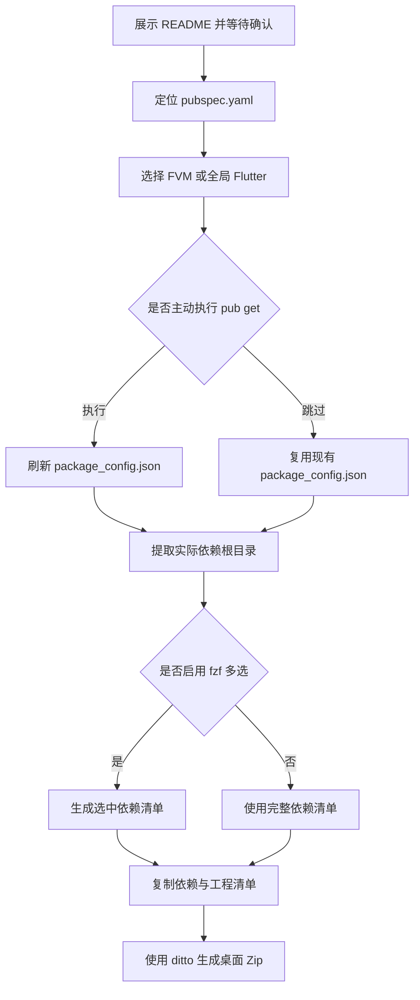

# `【MacOS】⚙️收集当前Flutter工程的依赖.command`


[toc]

---

## 🔥 <font id=前言>前言</font>

`【MacOS】⚙️收集当前Flutter工程的依赖.command` 用于收集当前 [**Flutter**](https://flutter.dev/) / [**Dart**](https://dart.dev) 工程已经解析到的依赖源码、原生依赖和关键清单文件，并在 MacOS 桌面生成带时间戳的 Zip 压缩包。

脚本只读取依赖和工程配置，不会自动执行 `pod install`，也不会复制整个 `~/.gradle/caches`。

## 一、适用场景 <a href="#前言" style="font-size:17px; color:green;"><b>🔼</b></a> <a href="#🔚" style="font-size:17px; color:green;"><b>🔽</b></a>

- 归档当前工程实际使用的 Dart / Flutter 包源码。
- 携带工程现有的 [**CocoaPods**](https://cocoapods.org/) `Pods`、SwiftPM 输出和依赖锁定文件。
- 排查离线环境、依赖版本或本地路径包问题。
- 使用 [**fzf**](https://formulae.brew.sh/formula/fzf) 从依赖清单中多选部分 Dart / Flutter 包。

## 二、目录结构

```text
【MacOS】⚙️收集当前Flutter工程的依赖.command/
├── 【MacOS】⚙️收集当前Flutter工程的依赖.command
└── README.md
```

脚本与 `README.md` 必须保持在同一目录。双击脚本后会先展示本文件，按回车才会继续，按 `Ctrl+C` 可以取消。

## 三、执行前检查

- 系统必须是 MacOS，并可使用系统命令 `zsh`、`rsync` 和 `ditto`。
- 工程根目录必须存在 `pubspec.yaml`。
- 必须能找到一种 Flutter 命令，优先级如下：

  1. 工程内 `.fvm/flutter_sdk/bin/flutter`。
  2. [**fvm**](https://fvm.app) 管理的 `fvm flutter`。
  3. 环境变量中的全局 `flutter`。

- 必须存在 [**Ruby**](https://www.ruby-lang.org)，用于解析 `.dart_tool/package_config.json`。
- 使用 `--select` 时必须提前安装 `fzf`：

  ```shell
  brew install fzf
  ```

## 四、运行方式

### 4.1、双击运行

在 Finder 中双击 `【MacOS】⚙️收集当前Flutter工程的依赖.command`。脚本会从自身目录向上查找 `pubspec.yaml`；如果没有找到，会提示输入或拖入 Flutter 工程根目录。

### 4.2、终端运行

```shell
cd "~/Downloads/【MacOS】⚙️收集当前Flutter工程的依赖.command"
./【MacOS】⚙️收集当前Flutter工程的依赖.command
```

### 4.3、参数说明

| 参数 | 作用 |
| --- | --- |
| `<path-to>/app` | 指定 Flutter / Dart 工程根目录 |
| `-s`、`--select` | 使用 `fzf` 多选 Dart / Flutter 依赖 |
| `--no-pub-get` | 不询问执行 `flutter pub get`，直接使用现有解析文件 |
| `-h`、`--help` | 显示命令行帮助 |

示例：

```shell
./【MacOS】⚙️收集当前Flutter工程的依赖.command "<flutter-root>_app"
./【MacOS】⚙️收集当前Flutter工程的依赖.command --select "<flutter-root>_app"
./【MacOS】⚙️收集当前Flutter工程的依赖.command --no-pub-get "<flutter-root>_app"
```

## 五、执行流程



## 六、压缩包内容

| 目录 | 内容 |
| --- | --- |
| `dart_packages/` | `.dart_tool/package_config.json` 实际解析到的包源码 |
| `native/` | 工程现有的 Pods、旧版插件 symlink 和 SwiftPM 输出 |
| `project_files/` | `pubspec.yaml`、锁定文件、Podfile、Gradle 声明等 |
| `manifest/` | 包清单、Flutter 版本、`pub deps` 输出与复制路径映射 |

压缩包默认输出到：

```text
~/Desktop/工程名_flutter_deps_时间戳.zip
```

## 七、交互与风险说明

- `flutter pub get` 可能更新 `.dart_tool` 和依赖解析结果，因此不会默认执行：直接回车跳过，输入任意字符后回车才执行。
- 如果跳过 `flutter pub get`，工程必须已经存在 `.dart_tool/package_config.json`，否则脚本会停止并给出提示。
- 脚本可能复制大量依赖文件，压缩耗时和结果体积取决于工程规模及现有 `Pods`、SwiftPM 输出。
- 临时目录仅创建在 `$TMPDIR` 下，脚本退出时只清理本次创建的临时目录。
- 不执行 `pod install`，不复制整个 Gradle 缓存，不修改依赖源码。

## 八、日志文件

终端输出会同步写入：

```text
$TMPDIR/pack_flutter_deps_macos.log
```

脚本每次启动都会清空旧日志。失败时优先查看日志中的 `✖` 错误信息和对应路径。

## 九、常见问题

### 9.1、提示未找到 Flutter

确认工程内 FVM SDK、系统 `fvm` 或全局 `flutter` 至少有一种可用：

```shell
flutter --version
fvm flutter --version
```

### 9.2、提示缺少 package_config.json

重新运行脚本，在询问 `flutter pub get` 时输入任意字符后回车执行；也可以先在工程目录手动运行：

```shell
flutter pub get
```

### 9.3、`--select` 无法使用

确认 `fzf` 已安装并能被当前终端找到：

```shell
command -v fzf
```

## 十、验证边界

脚本可以通过 `zsh -n` 做静态语法检查；依赖复制和压缩结果仍应在目标 Flutter 工程中实际运行后确认。本说明不代表已经对任意具体工程执行过真实打包。

<a id="🔚" href="#前言" style="font-size:17px; color:green; font-weight:bold;">我是有底线的➤点我回到首页</a>
